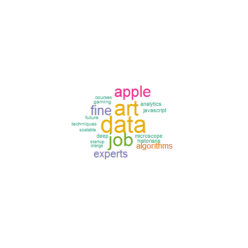

## Overview

This presentation includes the following parts.

> 1. Introduction
> 2. Input 
> 3. Output
> 4. References

--- 

## Introduction 

This Shiny App searches tweets containing keywords and plots a wordcloud for those tweets. When you specify the search term, the date ranges and number of tweets, this App will parse relevant tweets using twitter's API and plot a wordcloud.

App URL: http://purplesusy.shinyapps.io/twitter/

GitHub Repo: https://github.com/purplesusy/pml

R packages used:
- twitteR (twitter client for R)
- tm (text mining)
- wordcloud (wordclouds)
- RColorBrewer (color palettes)

---

## Input

Below lists contain the input fields. User can change those input fields and click "Update" to update the wordcloud.

- 1. Search Word(s) - the default is "machine learning"
- 2. Date Range - the defalt ending date is current system date and the default starting date is one day prior to system date
- 3. Number of Tweets - the default is 100 tweets

---

## Output 

After specifying the search word(s), date range, and number of tweets, a wordcloud for those tweets will be generated. 

Note: it takes a few seconds to generate the wordcloud.

 

---

## References

The work presented in this Shiny App is inspired by the following excellent work/tutorials:

- Shiny Tutorial (http://shiny.rstudio.com/tutorial/)
- Mining Twitter with R (https://sites.google.com/site/miningtwitter/)

Thank you!
